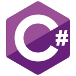
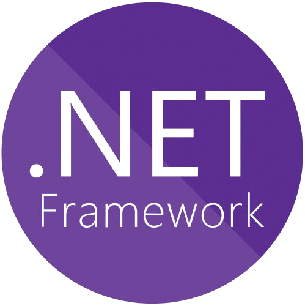

###

  
  
  

###

###

<h1 align="center">Hey there👋! </h1>

###

<h3 align="left">👩‍💻  About Me</h3>

###

I'm Alejo Legname from Buenos Aires, Argentina  - 🔭 I’m working as Back End Developer - 📚 I'm currently learning C# with .NET Framework - ⚡ In my free time I do Car detailing

###

<h3 align="left">🛠 Languages and tools</h3>

###

  
  
  
  
  
   
  
  
  
  
  
  
  
  
  
  
  

###

<h3 align="left">🔥   My Stats :</h3>

###

  

###
